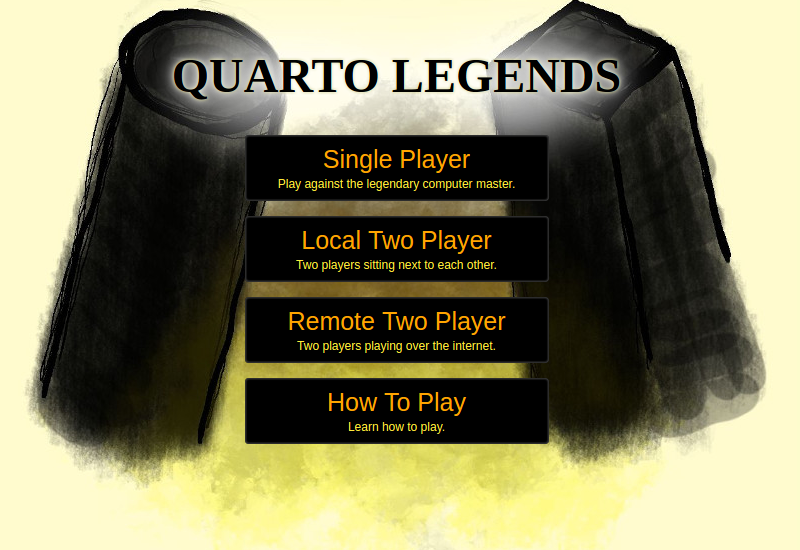

# Quarto

The game of Quarto.  [Try it here!](https://dgendill.com/content/quarto)

# Updates

## 11/17/2019

- Began update to use PureScript 0.13. See [migration-log.md](./migration-log.md) for details.
- Todo
    - [x] Get core 2 player functionality working  
    - [ ] Reimplement the "win menu" with halogen or purescript react
    - [ ] Get demo working
    - [ ] Get single player mode working
    - [ ] Write foreign library for paperjs
    - [ ] Migrate all the foreign code in the js folder

# About

Built using [Purescript](http://www.purescript.org/), [Halogen](https://github.com/slamdata/purescript-halogen), and
[PaperJS](http://paperjs.org/).  Multiplayer with [WebRTC](https://webrtc.org/).
